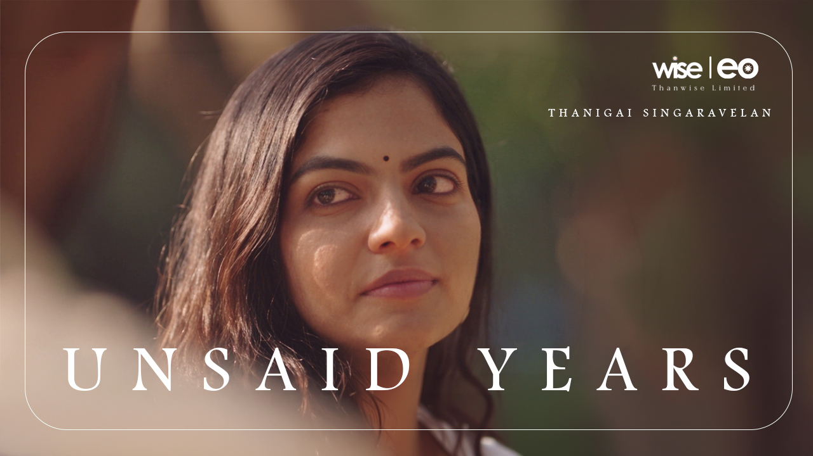
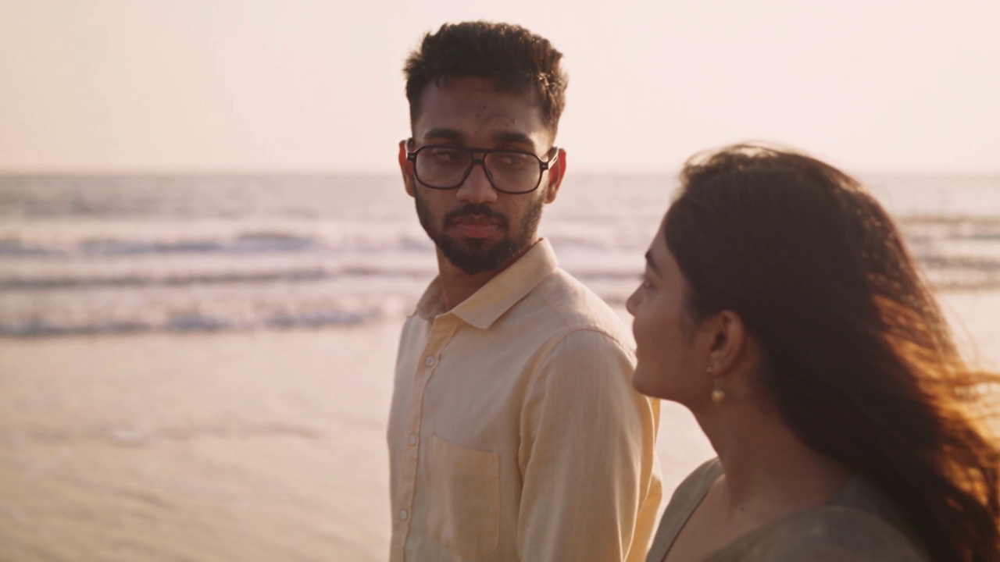
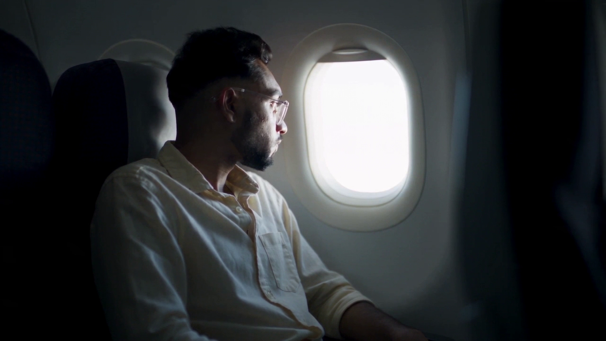
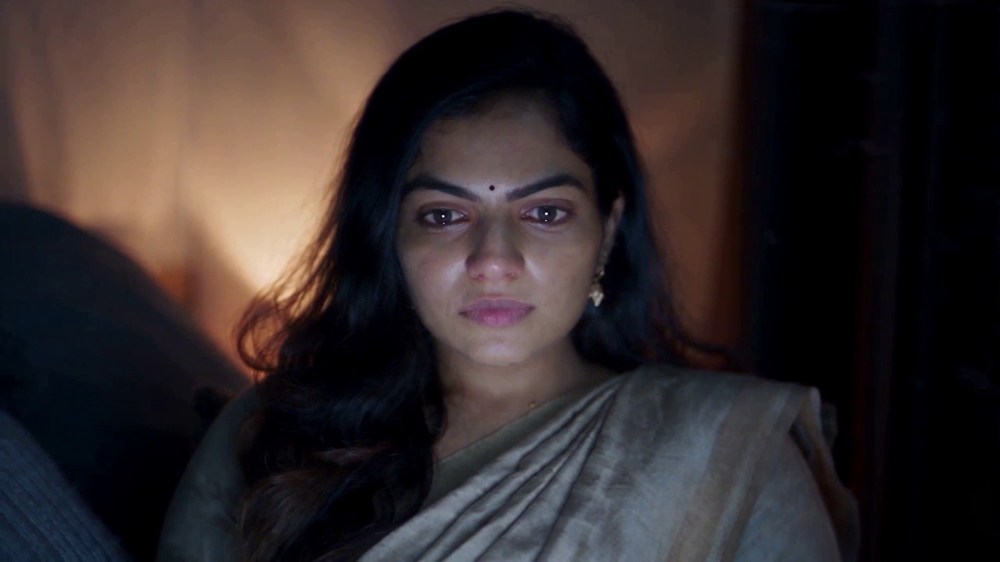
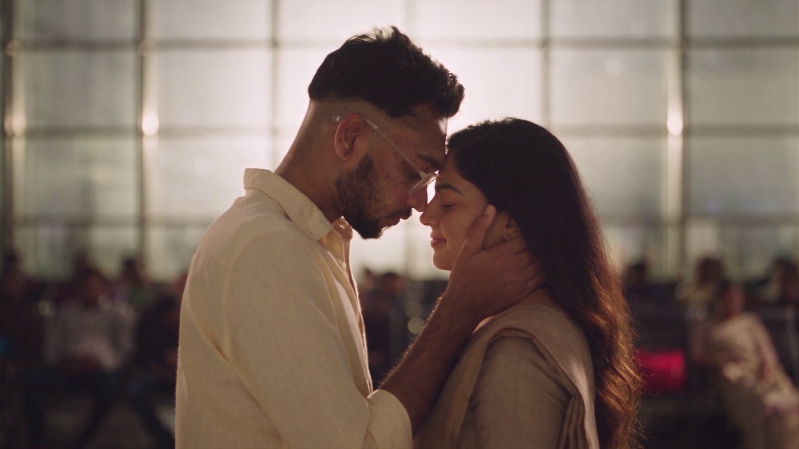

<p align="center">
  
</p>

<h1 align="center">Unsaid Years</h1>

<p align="center">
  A short film. 2 minutes 59 seconds.<br>
  <em>Give me your 2.59 minutes.</em>
</p>

<p align="center">
  <a href="#watch">Watch</a> ·
  <a href="#how-it-was-made">How it was made</a> ·
  <a href="#credits">Credits</a>
</p>

---

## About

He held one word back for six years. Tonight he says it.

Thane sits alone in a rented room in the UK, holding a marriage proposal his parents have sent him. A photograph of a girl he has never met. It forces open something he has kept shut since college.

First semester they were classmates. Second semester they were inseparable. Somewhere in between he fell in love with her and never said a word, because losing his best friend was the one thing he could not survive.

He watched another boy hand her a rose. He sat beside her when it ended and said nothing. Fate kept putting them in the same room, the same team, the same city, and still he stayed quiet. He left the country to outrun the feeling. It followed him.

Tonight he opens the chat and makes the call.

---

## Watch

| Platform | Link |
|---|---|
| YouTube (full film) | *https://youtu.be/3g5T5LVMC60?si=_c_18YfsQZNzzTNC* |

---

## Credits

**A film by Thanigai Singaravelan**

| Role | Name |
|---|---|
| Story | Thanigai Singaravelan |
| Direction | Thanigai Singaravelan |
| Editing | Thanigai Singaravelan |
| Music | Thanigai Singaravelan |
| Cast, Thane | Thanigai Singaravelan |
| Cast, Neethal | AI generated character |

**Associate and media partners:** Namakkal Jilla, Jeeva Arun, Abisheak

---

## How it was made

Every frame was generated with Seedance 2.5, built shot by shot from written prompts.

The method, in short:

1. **Script first.** The story was written as a normal short film script before any generation started.
2. **Shot breakdown.** Each scene was broken into 5 to 10 second shots, since generation holds together better in short pieces than in long ones.
3. **Continuity blocks.** Each character has a fixed written description covering face, hair, wardrobe and lighting. That block gets pasted into every prompt unchanged. It is the main thing keeping a character recognisable from shot to shot.
4. **Lighting as a system.** Grade, key light and colour were written once and repeated, rather than described fresh each time.
5. **Assembly.** Shots were cut together in edit, with grading and sound added afterwards.

### What worked

- Short passes. Three 10 second orbits held the face far better than one 30 second move.
- Describing camera moves mechanically rather than by name. "Camera dollies in while the lens zooms out" works. "Vertigo effect" often does not.
- Keeping the second character turned away, out of focus or in silhouette. A face that never resolves cannot drift.
- Negative prompts for the usual failure modes: extra fingers, warped glasses, changing face shape, text and logos.

### What did not

- On screen interface text. Legible chat windows came back garbled more often than not, and generated UI tends to invent brand-like marks. Composite it in post instead.
- Hands joining or interlacing. The hardest pose to get clean. Separating the hands, or cutting wide a beat earlier, is more reliable than regenerating.
- Mirrors. Asking for the back of a head and its reflection in one frame usually produces two different people.
- Morphs across a cut. Transitions are more dependable as two generated pieces blended in edit.

---

## Stills

<p align="center">
  
  
</p>

<p align="center">
  
  
</p>

---

## Note on the cast

The female lead is an entirely original AI character, built to a fixed written description and held consistent across the film. She is not based on, and does not depict, any real or existing person.

Every frame is original generated material. No existing footage, stock library or third party film content appears anywhere in the film.

---

## Repository contents

```
/prompts      shot by shot generation prompts
/script       screenplay
/stills       poster.jpg, still-01.jpg … still-04.jpg
/docs         production summary
```

---

## License

All rights reserved. See [LICENSE](LICENSE).
This work may not be reused, adapted or redistributed without written permission.

---

## Contact

Thanigai Singaravelan
thanigaisinga@gmail.com

If the film reached you, say so. I read everything.
